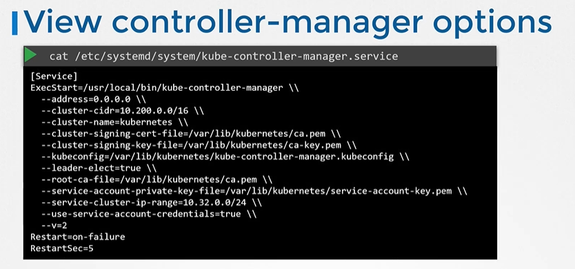

# Kube Controller Manager

  - Take me to [Video Tutorial](https://kodekloud.com/courses/539883/lectures/9808161)
  
In this section, we will take a look at kube-controller-manager.

#### Kube Controller Manager manages various controllers in kubernetes.
- In kubernetes terms, a controller is a process that continously monitors the state of the components within the system and works towards bringing the whole system to the desired functioning state.

## Node Controller
   - Responsible for monitoring the state of the Nodes and taking necessary actions to keep the application running. 
   - It does that with the help of kube-apiserver. Node Controller checks the status of the Nodes for every **`5 seconds`**. 
   - If a node is unreachable, Node Controller waits for **`40 seconds`** before marking it unreachable. 
   - After a node is marked as unreachable it gives it **`5 minutes`** to come backup.
  
   
   
## Replication Controller
   - It is responsible for monitoring the status of replicasets and ensuring that the desired number of pods are available at all time within the set.
   
   
   
## Other Controllers
   - There are many more such controllers available within kubernetes
     
   
   
   
  ## Installing Kube-Controller-Manager
  - When you install kube-controller-manager the different controllers will get installed as well.
  - Download the kube-controller-manager binary from the kubernetes release page. For example: You can download kube-controller-manager v1.13.0 here [kube-controller-manager](https://storage.googleapis.com/kubernetes-release/release/v1.13.0/bin/linux/amd64/kube-controller-manager)
    ```
    $ wget https://storage.googleapis.com/kubernetes-release/release/v1.13.0/bin/linux/amd64/kube-controller-manager
    ```
  - By default all controllers are enabled, but you can choose to enable specific one from **`kube-controller-manager.service`**
    ```
    $ cat /etc/systemd/system/kube-controller-manager.service
    ```
    
    
## View kube-controller-manager - kubeadm
- kubeadm deploys the kube-controller-manager as a pod in kube-system namespace
  ```
  $ kubectl get pods -n kube-system
  ```
  
  
## View kube-controller-manager options - kubeadm
- You can see the options within the pod located at **`/etc/kubernetes/manifests/kube-controller-manager.yaml`**
  ```
  $ cat /etc/kubernetes/manifests/kube-controller-manager.yaml
  ```
  
  
## View kube-controller-manager options - Manual
- In a non-kubeadm setup, you can inspect the options by viewing the **`kube-controller-manager.service`**
  ```
  $ cat /etc/systemd/system/kube-controller-manager.service
  ```
  
  
- You can also see the running process and affective options by listing the process on master node and searching for kube-controller-manager.
  ```
  $ ps -aux |grep kube-controller-manager
  ```
  
  
    
   
     
