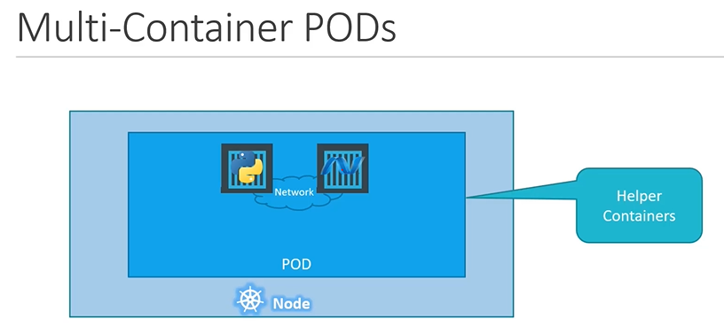

# Pods
  - Take me to [Video Tutorial](https://kodekloud.com/courses/539883/lectures/9808169)
  
In this section, we will take a look at PODS.
- POD introduction
- How to deploy pod?

#### Kubernetes doesn't deploy containers directly on the worker node.
- The containers are encapsulated into a kubernetes objects called **`POD`**.
- A POD is a single instance of an application.
- A POD is the smallest object that you can create in kubernetes

  
  
#### Here is a single node kubernetes cluster with single instance of your application running in a single docker container encapsulated in the pod.


#### Pod will have a one-to-one relationship with containers running your application.
- To scale up, you create a pod and to scale down, you delete a pod.
- You do not add additional containers to an existing POD to scale your application.

  
  
## Multi-Container PODs
- A single pod can have multiple containers except for the fact that they are usually not multiple containers of the **`same kind`**.
- Sometimes you might have a scenario where a helper containers that might be doing some kind of supporting tasks for a web application such as processing a user entered data, processing a file uploaded by the user etc. and you want these **`helper containers`** to live along side your application container. In that case you can have both of these containers part of the same POD.
  
  
  
## PODs (Docker Example)
  
  
  
## How to deploy pods?
- Lets now take a look the same docker example above to create a nginx pod using **`kubectl`**.

To deploy a docker container by creating a POD.
```
$ kubectl run nginx --image nginx
```

To get the list of pods
```
$ kubectl get pods
```

 


