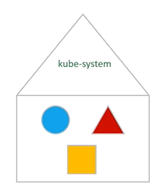
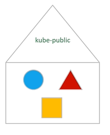
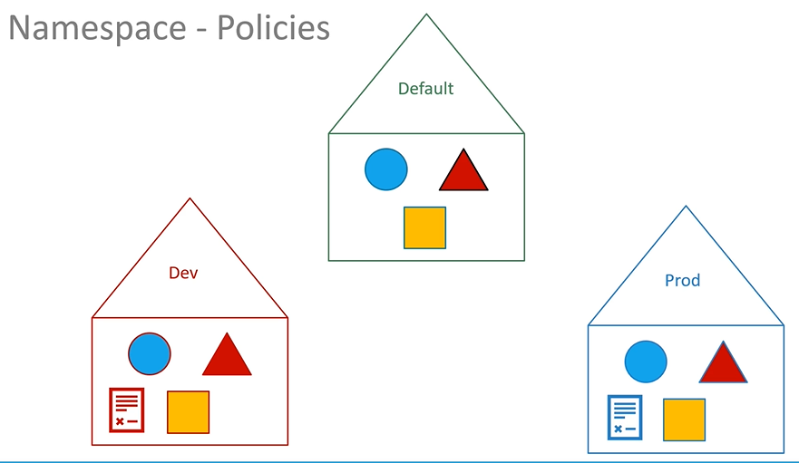
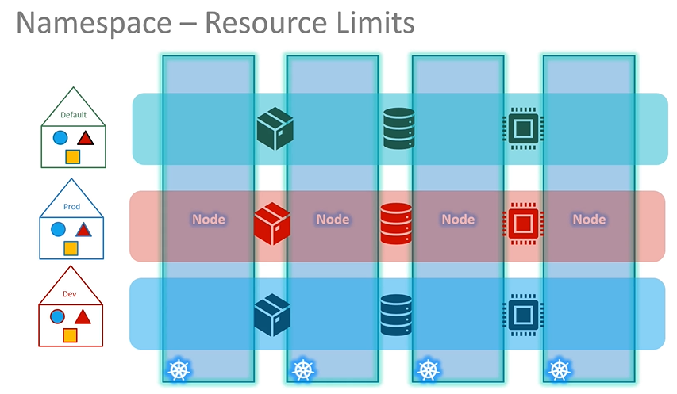
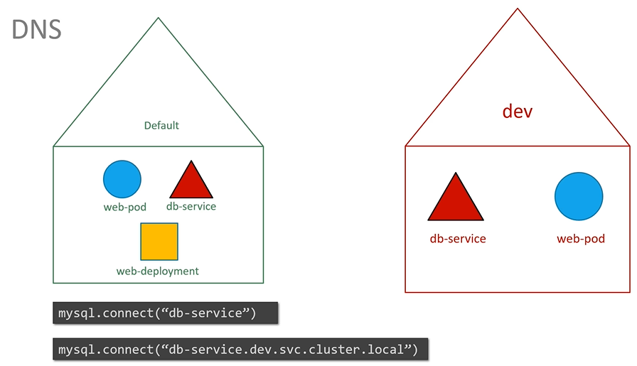

# Namespaces
  - Take me to [Video Tutorial](https://kodekloud.com/courses/539883/lectures/9808159)
  
In this section, we will take a look at **`Namespaces`**

So far in this course we have created **`Objects`** such as **`PODs`**, **`Deployments`** and **`Services`** in our cluster. Whatever we have been doing we have been doing in a **`NAMESPACE`**.
- This namespace is the **`default`** namespace in kuberntes. It is automatically created when kubernetes is setup initially.

  
  
- Kubernetes creates a set of pods and services for its internal purpose such as those requried by networking solutions, the DNS solutions etc. To isolate this from the user and to prevent you from accidently deleting and modifying the services, kubernetes creates them in another namespace(created at cluster startup) named **`kube-system`**.

  
  
- A third namespace created by kubernetes automatically is called **`kube-public`**. This is where resources that should be made available to user are created.
 
  

- You can create your own namespaces as well.

  

- Each of these namespaces can have its own set of **`policies`** that define who can do what.

  
  
- You can also assign quota of resources to each of these namespaces. That way each namespace is guaranteed a certain amount and does not use more than it's allowed limit.

  
  
- Going back to the default namespace that we have been working on, just like how members of a house refer to each other by their first names, the resources within a namespace can refer to each other simply by thier names. A resource in one namespace can also reach a resource of another namespace as well.
  
  
  
  
  
- To list the pods in default namespace
  ```
  $ kubectl get pods
  ```
- To list the pods in another namespace. Use **`kubectl get pods`** command along with the **`--namespace`** flag or argument.
  ```
  $ kubectl get pods --namespace=kube-system
  ```
  
  
- Here we have a pod defination file, when we create a pod with pod-defination file, the pod is created in the default namespace.
  ```
  $ kubectl create -f pod-defination.yaml
  ```
- To create the pod with the pod-defination file in another namespace, use the **`--namespace`** option.
  ```
  $ kubectl create -f pod-defination.yaml --namespace=dev
  ```
  

- If you want to make sure that this pod gets you created in the **`dev`** env all the time, even if you don't specify in the command line, you can move the **`--namespace`** defination into the pod-defination file.
  
  
  
- To create a new namespace, create a namespace defination as shown below and then run **`kubectl create`**
  ```
  $ kubectl create -f namespace-dev.yaml
  ```
  Another way to create a namespace
  ```
  $ kubectl create namespace dev
  ```
  
  
- By default, we will be in a **`default`** namespace. To switch to a particular namespace permenently run the below command.
  ```
  $ kubectl config set-context $(kubectl config current-context) --namespace=dev
  ```
- To view pods in all namespaces
  ```
  $ kubectl get pods --all-namespaces
  ```
  
  
- To limit resources in a namespace, create a resource quota. To create one start with **`ResourceQuota`** defination file.
  ```
  $ kubectl create -f compute-quota.yaml
  ```
  
  
K8s Reference Docs:
- https://kubernetes.io/docs/concepts/overview/working-with-objects/namespaces/
- https://kubernetes.io/docs/tasks/administer-cluster/namespaces-walkthrough/
- https://kubernetes.io/docs/tasks/administer-cluster/namespaces/
- https://kubernetes.io/docs/tasks/administer-cluster/manage-resources/quota-memory-cpu-namespace/
- https://kubernetes.io/docs/tasks/access-application-cluster/list-all-running-container-images/
  
  
  
  
  
  
