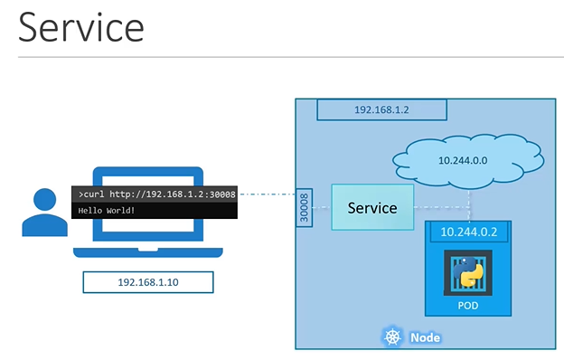
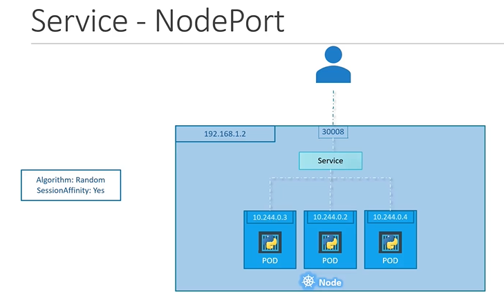

# Kubernetes Services
  - Take me to [Video Tutorial](https://kodekloud.com/courses/539883/lectures/9808156)
  
In this section we will take a look at **`services`** in kuberentes

Services
- Kubernetes Services enables communication between various components within an outside of the application.
- Kubernetes Services helps us connect applications together with other applications or users.
- Services enables frontend applications to be made available to endusers. It helps communications between **`backend`** and **`frontend`** pods and it helps to establish connecivity to an **`external datasource`**
- Thus, services enables loose coupling between microservices in our application.
  
  
#### Let's look at some other aspects of networking

## External Communication
- So, we deployed our **`POD`** having a **`web application`** on it. How do we as an **`external user`** access the **`web page`**?
  - From the node (Able to reach the application as expected)
  
    
    
  - From outside world (This should be our expectation, without something in the middle it will not reach the application)
  
    
    
  - We need something in the middle to help us to map requests to the node (say from our laptop through the node to the pod running the web container). This is where the **`kubernetes service`** comes into play.
    
    

  - This type of service is know as a **`Node Port`** service, because the service listens to a pod on the node and forward requests to the POD.
    
 ## Service Types
 There are 3 types of service types in kubernetes
 
    
 
 1. NodePort
    - Where the services makes an internal POD accessable on a POD on the NODE.
      
      
      
      #### To connect the service to the pod
      
      
      
      #### To create the service
      ```
      $ kubectl create -f service-defination.yaml
      ```
      
      #### To list the services
      ```
      $ kubectl get services
      ```
      
      #### To access the application from CLI instead of web browser
      ```
      $ curl http://192.168.1.2:30008
      ```
      
      

      #### A service with multiple pods
      
      
      
      #### When Pods are distributed across multiple nodes
     
      
     
            
 1. ClusterIP
    - In this case the service creates a **`Virtual IP`** inside the cluster to enable communication between different services such as a set of frontend servers to a set of backend servers.
    
 1. LoadBalancer
    - Where provisions a **`loadbalancer`** for our application in supported cloud providers.

