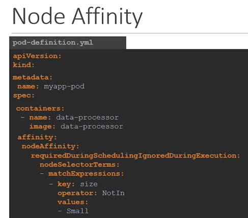

# Node Affinity
  - Take me to the [Video Tutorial](https://kodekloud.com/courses/539883/lectures/10277936)
  
In this section, we will talk about "Node Affinity" feature in kubernetes.

#### The primary feature of Node Affinity is to ensure that the pods are hosted on particular nodes.
- With **`Node Selectors`** we cannot provide the advance expressions.
  ```
  apiVersion: v1
  kind: Pod
  metadata:
   name: myapp-pod
  spec:
   containers:
   - name: data-processor
     image: data-processor
   nodeSelector:
    size: Large
  ```
  
  ```
  apiVersion: v1
  kind: Pod
  metadata:
   name: myapp-pod
  spec:
   containers:
   - name: data-processor
     image: data-processor
   affinity:
     nodeAffinity:
       requiredDuringSchedulingIgnoredDuringExecution:
          nodeSelectorTerms:
          - matchExpressions:
            - key: size
              operator: In
              values: 
              - Large
              - Medium
  ```
  
  
  ```
  apiVersion: v1
  kind: Pod
  metadata:
   name: myapp-pod
  spec:
   containers:
   - name: data-processor
     image: data-processor
   affinity:
     nodeAffinity:
       requiredDuringSchedulingIgnoredDuringExecution:
          nodeSelectorTerms:
          - matchExpressions:
            - key: size
              operator: NotIn
              values: 
              - Small
  ```
  
  
  ```
  apiVersion: v1
  kind: Pod
  metadata:
   name: myapp-pod
  spec:
   containers:
   - name: data-processor
     image: data-processor
   affinity:
     nodeAffinity:
       requiredDuringSchedulingIgnoredDuringExecution:
          nodeSelectorTerms:
          - matchExpressions:
            - key: size
              operator: Exists
  ```
  
  
  
- What if node affinity could not match a node with a given expression. In this case, what if no nodes with the label called size say we had the labels and the pods are scheduled. 
- What if someone changes the label on the node at a future point in time? Will the pod continue to stay on the Node?
- All of this is answered by the long sentence like property under node affinity which happens to be the type of node affinity defines the behaviour of the scheduler with respect to  node affinity and the stages in the lifecycle of the pod.

## Node Affinity Types
- Available
  - requiredDuringSchedulingIgnoredDuringExecution
  - preferredDuringSchedulingIgnoredDuringExecution
- Planned
  - requiredDuringSchedulingRequriedDuringExecution
  - preferredDuringSchedulingRequiredDuringExecution
  
  
  
## Node Affinity Types States

  
  
  
  
