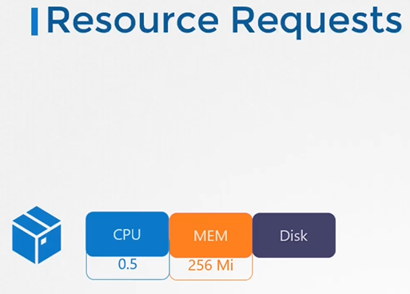
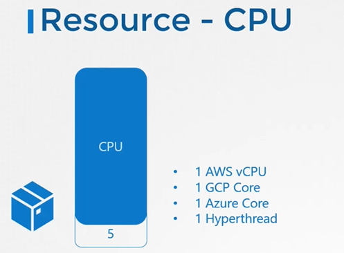
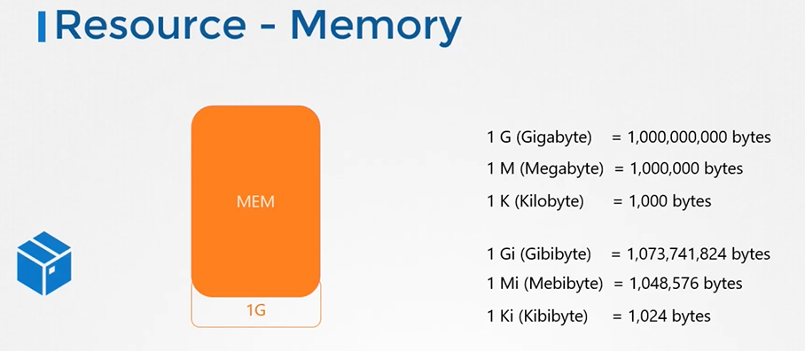

# Resource Limits
  - Take me to [Video Tutorials](https://kodekloud.com/courses/539883/lectures/9816620)
  
In this section we will take a look at Resource Limits

#### Let us take a look at 3 node kubernetes cluster.
- Each node has a set of CPU, Memory and Disk resources available.
- Every pod consumes a set of resources 
- Whenever a POD is placed on a Node, it consumes resources available to that node.
- Kubernetes scheduler that decides which node a pod goes to. The scheduler takes into consideration, the amount of resources requrired by a POD and those available on the Node.
- If the node has no sufficient resources, the scheduler avoids placing the POD on the node instead places the pod on one where sufficient resources are available if there is no sufficient resources available on any of the nodes
- If there is no sufficient resources available on any of the nodes, kubernetes holds the scheduling the pod. You will see the pod in pending state. If you look at the events, you will see the reason as insufficient CPU.
  
  
  
## Resource Requirements
- By default, K8s assume that a pod or container within a pod requires **`0.5`** CPU and **`256Mi`** of memory. This is known as the **`Resource Request` for a container**.
  
  
  
- If your application within the pod requires more than the default resources, you need to set them in the pod defination file.

  
  
## Resource - CPU

   

## Resource - Memory

   
   
## Resources - Limits
- By default, k8s sets resource limits to 1 CPU and 512Mi of memory
  
  
  
- You can set the resource limits in the pod defination file.

  
  
#### Note: Remember Requests and Limits for resources are set per container in the pod.
  
## Exceed Limtis
- what happens when a pod tries to exceed resources beyond its limits?
 - In case of CPU, kubernetes **`throttle`** the CPU so that it doesn't go beyond the specified limit.
 - However this is not the case with memory, a container can use more memory resources than its limit. So, if a pod consumes more memory than its limit **`constantly`** then the pod will be terminated.

   
   
  

  
  
