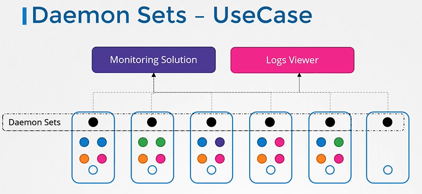

# DaemonSets
  - Take me to [Video Tutorial](https://kodekloud.com/courses/539883/lectures/9815302)

In this section, we will take a look at DaemonSets.

#### DaemonSets are like replicasets, as it helps in to deploy multiple instances of pod. But it runs one copy of your pod on each node in your cluster.
- Whenever a new node is added to the cluster a replica of the pod is automatically added to that node and when a node is removed the pod is automatically removed
- The daemonsets ensures that copy one copy of the pod is always present in all nodes in the cluster.
  
  
  
## DaemonSets - UseCases

  
  
  
  
  
  
## DaemonSets - Defination
- Creating a DaemonSet is similar to the ReplicaSet creation process.
- For DaemonSets, we start with apiVersion, kind as **`DaemonSets`** instead of **`ReplicaSet`**, metadata and spec. 
  
  
  
- To create a daemonset from a defination file
  ```
  $ kubectl create -f daemon-set-defination.yaml
  ```

## View DaemonSets
- To list daemonsets
  ```
  $ kubectl get daemonsets
  ```
- For more details of the daemonsets
  ```
  $ kubectl describe daemonsets monitoring-daemon
  ```
  
  
## How DaemonSets Works

  

  
  
  
