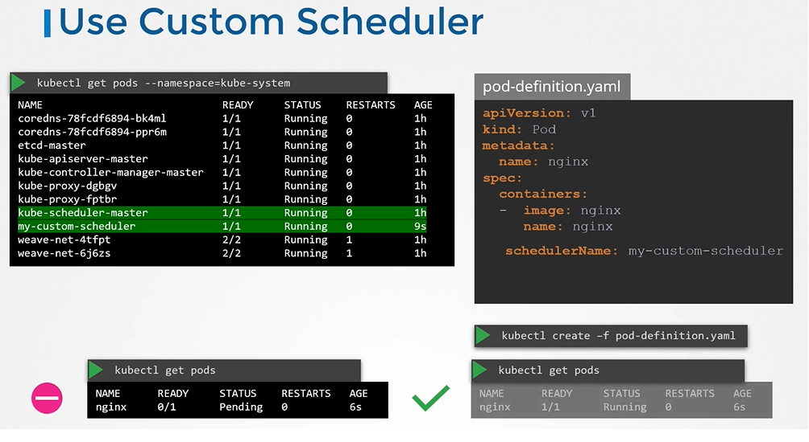

# Multiple Schedulers 
  - Take me to [Video Tutorial](https://kodekloud.com/courses/539883/lectures/9815299)

In this section, we will take a look at multiple schedulers

## Custom Schedulers
- You can write your own kubernets scheduler program, package it and deploy it as the default scheduler or as an additional scheduler in the kubernetes cluster. 
- You kubernetes cluster can schedule multiple schedulers at the same time.

  
  
## Deploy additional scheduler
- Download the binary
  ```
  $ wget https://storage.googleapis.com/kubernetes-release/release/v1.12.0/bin/linux/amd64/kube-scheduler
  ```
  
  
## Deploy additional scheduler - kubeadm

  
  
  - To create a scheduler pod
    ```
    $ kubectl create -f my-custom-scheduler.yaml
    ```
  
## View Schedulers
- To list the scheduler pods
  ```
  $ kubectl get pods -n kube-system
  ```

## Use the Custom Scheduler
- Create a pod defination file and add new section called **`schedulerName`** and specify the name of the new scheduler

  
  
- To create a pod definaton
  ```
  $ kubectl create -f pod-defination.yaml
  ```
- To list pods
  ```
  $ kubectl get pods
  ```

## View Events
- To view events
  ```
  $ kubectl get events
  ```
  
  
## View Scheduler Logs
- To view scheduler logs
  ```
  $ kubectl logs my-custom-scheduler -n kube-system
  ```
  
  

  
