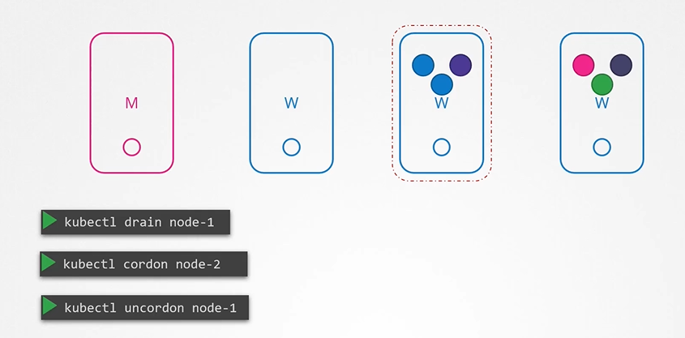

# OS Upgrades
  - Take me to [Video Tutorial](https://kodekloud.com/courses/539883/lectures/9808229)
  
In this section, we will take a look at os upgrades.
- We wull discuss about scenarios where you might have to take down node as part of your cluster for maintenance purposes like upgrading a base software or applying patches like security patches etc.

#### If the node was down for more than 5 minutes, then the pods are terminated from that node
- If the pods where part of a replicaset then they are recreated on other nodes.
- The time it waits for a pod to come back online is known as the **`pod eviction timeout`** and is set on the controller manager with a default value of 5 minutes.

  
  
- When the node comes online after the pod eviction timeout it comes up blank without any pods scheduled on it.
- Thus, if you have maintenance tasks to be performed on a node if you know that the workloads running on the node have other replicas and if it's okay that they go down for a short period of time and if you're sure the node will come back online within 5 minutes you make a quick upgrade and reboot. But you are not sure if a node is going to be back online in 5 mintues.
- You can purposefully **`drain`** the node of all the workloads so that the workloads are moved to other nodes.
- Well technically they are not moved. When you drain the node the pods are gracefully terminated from the node that they're on and recreated on another.
  ```
  $ kubectl drain node-1
  ```
- The node is also cordoned or marked as unschedulable.
- When the node is back online after a maintenance, it is still unschedulable. You then need to uncordorn it.
  ```
  $ kubectl uncordorn node-1
  ```
- There is also another command called cordorn. Cordorn simply marks a node unschedulable. Unlike drain it does not terminate or move the pods on an existing node.

  
  
  
