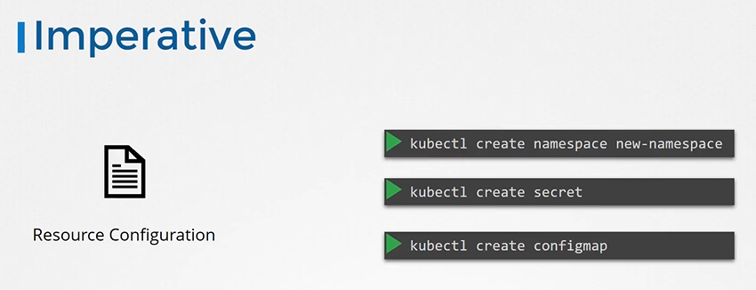
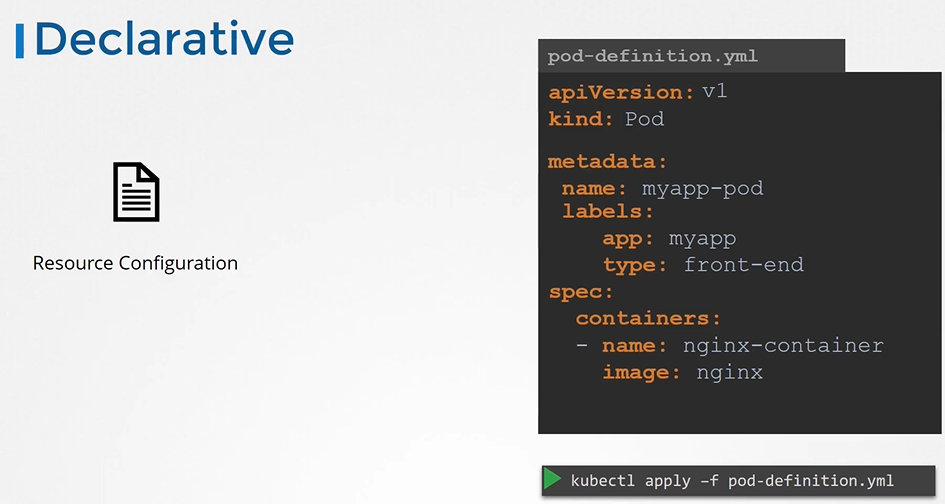
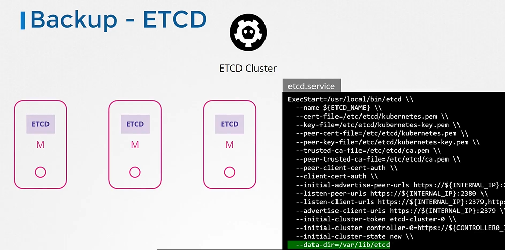

# Backup and Restore Methods
  - Take me to [Video Tutorial](https://kodekloud.com/courses/539883/lectures/9808228)
  
In this section, we will take a look at backup and restore methods

## Backup Candidates
 
 
 
## Resource Configuration
- Imperative way
  
  

- Declarative Way (Preferred approach)
  ```
  apiVersion: v1
  kind: Pod
  metadata:
    name: myapp-pod
    labels:
      app: myapp
      type: front-end
  spec:
    containers:
    - name: nginx-container
      image: nginx
  ```
 
 
- A good practice is to store resource configurations on source code repositories like github.

  

## Backup - Resource Configs

  ```
  $ kubectl get all --all-namespaces -o yaml > all-deploy-services.yaml (only for few resource groups)
  ```

- There are many other resource groups that must be considered. There are tools like **`ARK`** or now called **`Velero`** by Heptio that can do this for you.

  
  
## Backup - ETCD
- So, instead of backing up resources as before, you may choose to backup the ETCD cluster itself. 
  
  
  
- You can take a snapshot of the etcd database by using **`etcdctl`** utility snapshot save command.
  ```
  $ ETCDCTL_API=3 etcdctl snapshot save snapshot.db
  ```
  ```
  $  ETCDCTL_API=3 etcdctl snapshot status snapshot.db
  ```
  
  
## Restore - ETCD
- To restore etcd from the backup at later in time. First stop kube-apiserver service
  ```
  $ service kube-apiserver stop
  ```
- Run the etcdctl snapshot restore command
- Update the etcd service
- Reload system configs
  ```
  $ systemctl daemon-reload
  ```
- Restart etcd
  ```
  $ service etcd restart
  ```
  
  
  
- Start the kube-apiserver
  ```
  $ service kube-apiserver start
  ```
#### With all etcdctl commands specify the cert,key,cacert and endpoint for authentication.
```
$ ETCDCTL_API=3 etcdctl \
  snapshot save /tmp/snapshot.db \
  --endpoints=https://[127.0.0.1]:2379 \
  --cacert=/etc/kubernetes/pki/etcd/ca.crt \
  --cert=/etc/kubernetes/pki/etcd/etcd-server.crt \
  --key=/etc/kubernetes/pki/etcd/etcd-server.key
```

  
  
#### K8s Reference Docs
- https://kubernetes.io/docs/tasks/administer-cluster/configure-upgrade-etcd/


 
