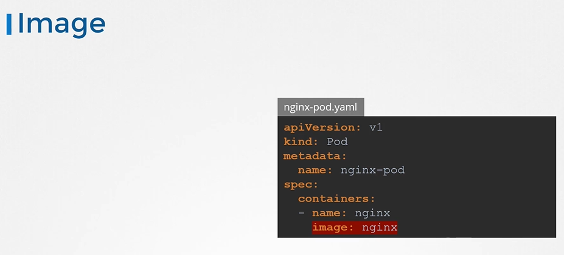

# Image Security
  - Take me to [Video Tutorial](https://kodekloud.com/courses/539883/lectures/9808251)

In this section we will take a look at image security

# Image
  
  
  
  
  
# Private Registry
- To login to the registry
  ```
  $ docker login private-registry.io
  ```
- Run the application using the image available at the private registry
  ```
  $ docker run private-registry.io/apps/internal-app
  ```
  
  
  
- To pass the credentials to the docker untaged on the worker node for that we first create a secret object with credentials in it.
  ```
  $ kubectl create secret docker-registry regcred \
    --docker-server=private-registry.io \ 
    --docker-username=registry-user \
    --docker-password=registry-password \
    --docker-email=registry-user@org.com
  ```
- We then specify the secret inside our pod defination file under the imagePullSecret section 
  
  
  
  
